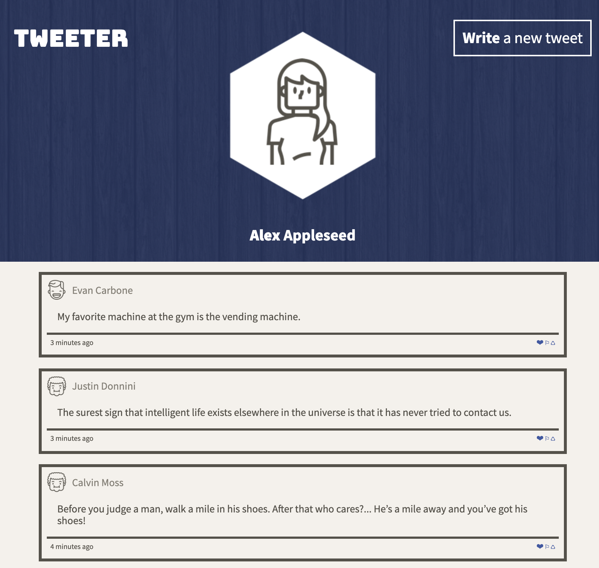
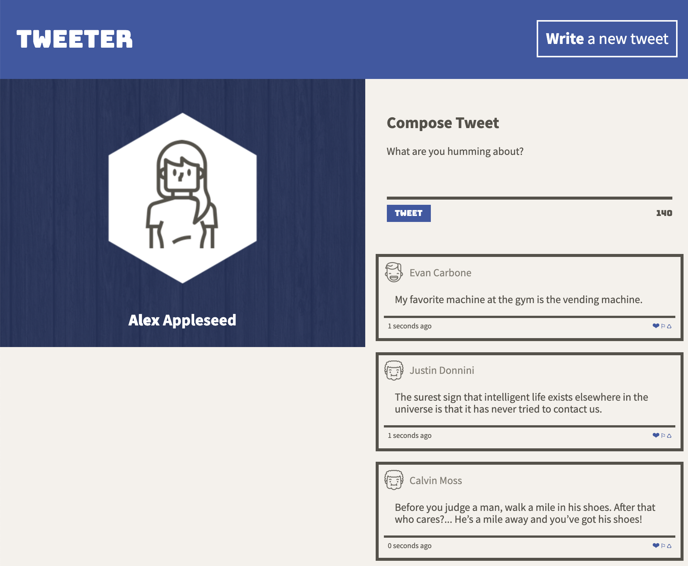

# Tweeter Project

Tweeter is a simple, single-page Twitter clone.

This project uses HTML, CSS, JS, jQuery and AJAX on the front-end as well as Node and Express on the back-end. It has features such as responsive design (mobile and desktop friendly), server posting/retrieval with AJAX, and form validation.

# Final Product

### Mobile / Tablet View

### Desktop View

# Getting Started

1. Install dependencies using the `npm install` command.
2. Start the web server using the `npm run local` command. The app will be served at <http://localhost:8080/>.
3. Go to <http://localhost:8080/> in your browser.

# Dependencies
- Express
- Node 5.10.x or above
- Body-parser
- Chance
- Express
- md5
